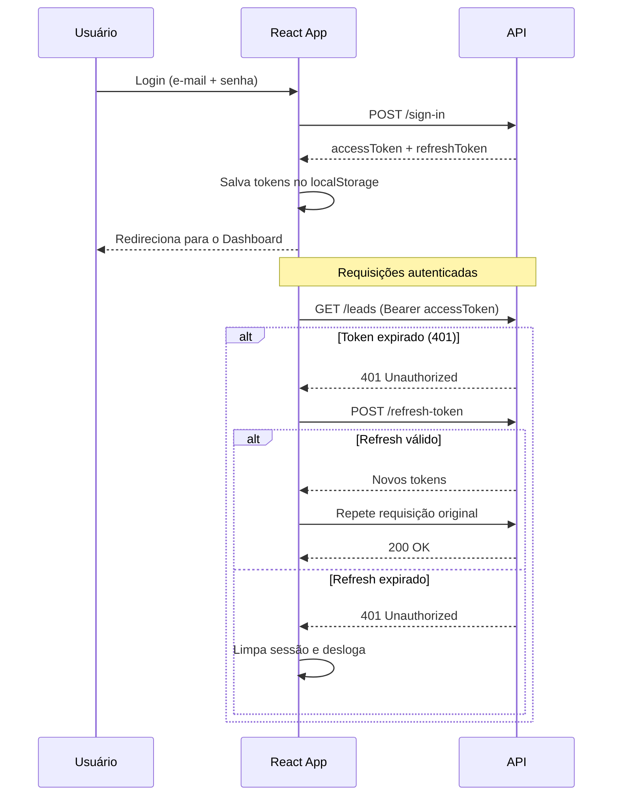
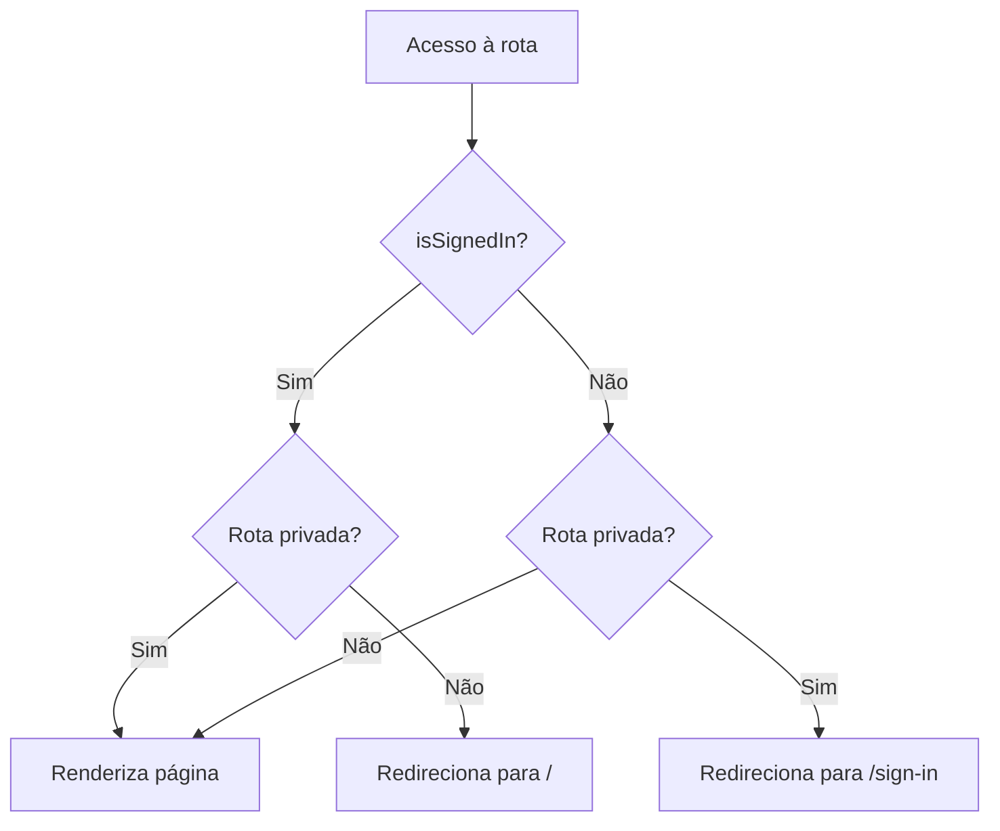

# React Auth Flow

Aplicação SPA em React que implementa um fluxo de autenticação completo com **access token** e **refresh token**, incluindo rotação automática de tokens via interceptors do Axios. Após autenticado, o usuário acessa um dashboard que lista os _leads_ carregados a partir de uma API protegida.

## ✨ Funcionalidades

| Funcionalidade         | Descrição                                                                              |
| ---------------------- | -------------------------------------------------------------------------------------- |
| **Cadastro**           | Registro de novos usuários em `/sign-up`                                                |
| **Login**              | Autenticação com e-mail e senha em `/sign-in`                                           |
| **Rotas protegidas**   | Redirecionamento automático com `AuthGuard`                                             |
| **Rotação de token**   | Ao receber `401`, o refresh token gera um novo access token e repete a requisição       |
| **Logout de sessão**   | Limpeza da sessão quando o refresh token expira                                         |
| **Dashboard**          | Listagem de leads (nome e e-mail)                                                       |
| **Tema claro/escuro**  | Alternância de tema com toggle                                                          |
| **Toasts globais**     | Feedback de sucesso e de erros de queries                                               |

## 🛠️ Stack

| Categoria         | Tecnologias                                                                 |
| ----------------- | -------------------------------------------------------------------------- |
| **Core**          | [React 19](https://react.dev/) + [React Compiler](https://react.dev/learn/react-compiler), [TypeScript](https://www.typescriptlang.org/) |
| **Build**         | [Vite](https://vite.dev/)                                                  |
| **Roteamento**    | [React Router](https://reactrouter.com/) (lazy loading)                    |
| **Data fetching** | [TanStack Query](https://tanstack.com/query), [Axios](https://axios-http.com/) |
| **Formulários**   | [React Hook Form](https://react-hook-form.com/) + [Zod](https://zod.dev/)  |
| **UI**            | [Tailwind CSS 4](https://tailwindcss.com/), [shadcn/ui](https://ui.shadcn.com/), [Base UI](https://base-ui.com/) |
| **Qualidade**     | [Biome](https://biomejs.dev/), [Husky](https://typicode.github.io/husky/) + [Commitlint](https://commitlint.js.org/) |

## 🔐 Fluxo de autenticação

## 🧭 Proteção de rotas

